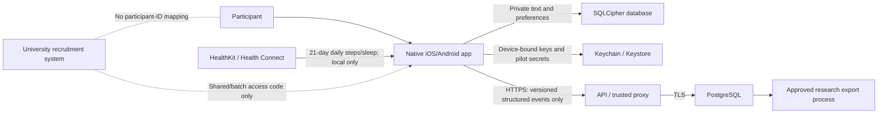

# MindSHED pilot threat model

Updated: 21 July 2026
Method: lightweight STRIDE/privacy review of the implemented pilot boundary
Status: engineering model; controller and independent security review required

## 1. Scope and security objectives

Protect private on-device wellbeing content and pseudonymous research records
while preserving the participant's ability to use local features, decline
research, withdraw and delete. The pilot intentionally has no MindSHED name,
email or university-identity account.

Primary objectives:

- journal, notes, support-plan text, name and phone-health summaries never enter
  the pilot API;
- only a consented, versioned, bounded structured dataset leaves the device;
- one participant credential cannot read or alter another participant's record;
- withdrawal/deletion take effect locally offline and converge safely online;
- no placeholder/unapproved configuration can silently become production;
- operational metadata does not recreate the identity mapping excluded by the
  application design.

## 2. Data flow and trust boundaries

Trust boundaries are the device OS, native health provider, public network,
proxy/API runtime, database/backup platform, research export environment and
University recruitment system. The browser is outside scope and initializes no
private or pilot services.

## 3. Assets

- journal/check-in note/support plan/profile and health summaries;
- research consent choices and exact document versions;
- participant token, deletion secret, SQLCipher key and batch-code HMAC key;
- pseudonymous structured events and participant ID;
- raw batch access code and cohort capacity;
- production database, backups, image/signing credentials and release switches;
- legal/ethics approval evidence and researcher exports.

## 4. Threats, controls and residual risk

| Threat | Implemented controls | Residual/external work |
| --- | --- | --- |
| Lost or casually inspected phone | SQLCipher, SecureStore device-bound key, app-switcher cover, no notification content beyond a generic nudge | OS passcode, rooted/jailbroken device, screenshots and forensic extraction need device/MASVS testing |
| OS backup/device transfer exposes data | Android backup/full-backup disabled; SecureStore key is device-only; missing SQLCipher key resets an unreadable restored database | Verify iCloud/Android transfer on physical release builds and document expected data loss |
| Another app/browser reads private state | Native sandbox; browser mounts no store/API; exports use app cache and delete in `finally` | Chosen share destination is outside MindSHED; test malicious/failed share targets |
| Free text or identifiers reach research | Strict Zod objects reject unknown/denylisted fields; mobile constructs allowlisted events; contract tests cover note/email/device/timestamp fields | Re-run proxy/log/backup inspection and independent DAST before release |
| Cross-participant access | 256-bit random tokens, hashed storage, participant ID plus matching token/secret, integration test for mismatched credentials | No recovery by identity is possible; participant wording and support procedures must accept this |
| Access-code guessing/enumeration | HMAC storage, 12+ character operational requirement, generic invalid/inactive/full response, rate limit and atomic capacity | WAF/DDoS controls and code entropy/rotation are deployment responsibilities |
| Credential replay or lost response | Idempotent event UUID, one event per day/kind, participant row lock, idempotent withdrawal, deletion retry treats absence as terminal | A stolen live token remains usable until withdrawal/deletion/retention; there is no identity-based revocation |
| Consent bypass/race | Exact versions, terms/research/health invariant, server-side legal/marketing/upload gates, participant lock and bounded consent history | Signed wording and consent lawful-basis decision are external gates |
| Excessive or malformed data | 128 KiB body, strict schemas, 50-event batch, participant history quotas, database checks and transactions | Deployed gateway limits and load testing remain required |
| Network interception | Production mobile requires non-local HTTPS; API requires database TLS; Android release rejects cleartext | No certificate pinning; verify TLS/proxy configuration and interception resistance independently |
| Sensitive logging/telemetry | Fastify request logging disabled; body/params/query/auth redaction; no analytics, crash SDK, push token or remote inbox | Provider/CDN/database logs and future crash monitoring must be configured to the same boundary |
| Infrastructure/operator re-identification | No direct identifiers or recruitment mapping; relative days; no client event time; phone health excluded | IP/provider metadata, rare response patterns and researcher singling-out require DPIA/anonymisation review |
| Researcher overreach | Versioned data dictionary and bounded participant export | Named access, MFA, small-cell rules, identifier rotation and approved extract pipeline are not implemented here |
| Server/database outage | Encrypted local-first app, persisted queue, exponential backoff/jitter, readiness endpoint and independent pause switches | Multi-zone architecture, failover, alerting and restore drill require production infrastructure |
| Destructive action lost offline | SecureStore action precedes local clear; deletion > withdrawal > opt-out; governance sync runs before upload | Physical force-quit/storage-failure scenarios must pass; server backup expiry remains external |
| Dependency/build compromise | Lockfile, pinned GitHub Action commits, pinned Node container digest, non-root runtime, high/critical audit gate | 13 moderate Expo build-tool advisories, registry/SBOM/SAST/signing provenance and independent review remain |
| Unsafe wellbeing claim or missed crisis | No monitoring/diagnosis claim, local support presentation, official support routes, crisis interactions excluded from upload | Safeguarding/clinical review, adverse-event route and content update owner must sign off |

## 5. Abuse cases explicitly tested

- unknown/free-text/direct-identifier/exact-timestamp research fields rejected;
- incomplete or incorrectly scored SWEMWBS payload rejected;
- batch over 50, invalid semantic app version and duplicate logical event rejected;
- mismatched participant ID/token and wrong deletion secret rejected;
- participant consent/event hard quotas enforced;
- invalid, expired, paused and exhausted access codes do not reveal which state;
- CORS denies unapproved origins and production rejects HTTP origins;
- repeated HTTP calls reach a non-reflective 429 response;
- oversized request reaches 413;
- old app version and disabled legal/upload/SWEMWBS states fail closed;
- withdrawal retry does not add duplicate consent history;
- deletion cascades and later participant access fails;
- lifecycle execution cannot affect a different study scope.

## 6. Go/no-go security evidence still required

- independent mobile/API penetration test using the deployed proxy boundary;
- OWASP MASVS device checks, local extraction and network interception;
- secret scanning/push protection and protected-branch/review ownership enabled;
- registry/container/SBOM/SAST/IaC scanning with remediation owner and SLA;
- production role/permission review, WAF/load test and privacy-safe monitoring;
- encrypted backup restore plus deletion/backup-expiry exercise;
- researcher threat/privacy assessment and approved extract implementation;
- incident/breach tabletop, key/token compromise drill and signing-account recovery;
- named acceptance of the residual risks above.

This model must be updated whenever a new SDK, analytics/crash service, remote
notification, account/recovery mechanism, research field, health source,
browser client or researcher export path is introduced.
